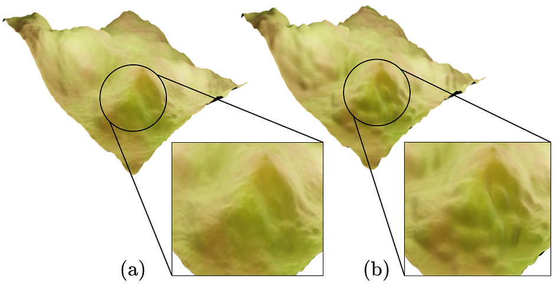
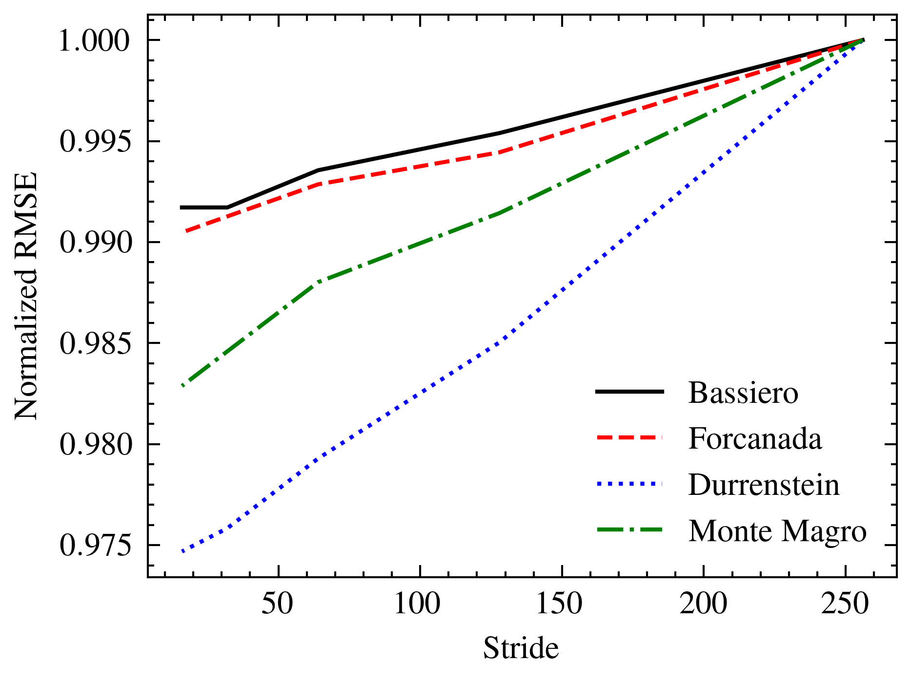
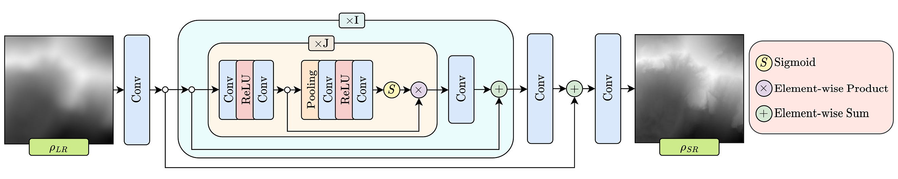

# TRCAN

Terrain RCAN is a state-of-the-art terrain super-resolution model proposed in the paper *"Adaptive & Multi-Resolution Procedural Infinite Terrain Generation with Diffusion Models and Perlin Noise"*.




Terrain enhancement where (a) is enhanced to (b).




Effect of stride on the RMSE.




Architectural diagram of the proposed terrain super-resolution model TRCAN.


It was modified and tuned for terrain super-resolution from the natural image super-resolution model RCAN. The code structure is kept simple, with single files for data-preparation (prepare_tiles.py), training (train.py) and testing (test.py).

* `prepare_tile.py`: This file is used to break a terrain tile into patches. Refer https://gitrepos.virvig.eu/oargudo/fcn-terrains for more details and to download the dataset. The size of the tiles were kept 256.
* `train.py`: Used to train the model. Change the paths where indicated in the code and run. Model weights will be saved. Compared to RCAN, you would find minor modifications like the change in head of the model to suit terrain (since it is difficult to get LR-HR correspondence in terrain which preparing tiles). Furthermore, the parameters of the model are tuned.
* `test.py`: Used for testing the model on the test set. Change the paths where indicated in the code and run. The post-processing technique proposed and used in this file might take time, you can change the limit in the code if you observe diminishing returns in PSNR gains.
* weights.pth: The trained model weights.

Standard libraries were used including PyTorch, Numpy, PIL.


Project page link: https://3dcomputervision.github.io/publications/inf_terrain_generation.html

Video link: https://www.youtube.com/watch?v=6Uz6m4piXYI

Paper link: https://3dcomputervision.github.io/assets/pdfs/inf_terrain_generation.pdf

BibTex:

```
@inbook{10.1145/3571600.3571657
  author = {Jain, Aryamaan and Sharma, Avinash and Rajan, K S},
  title = {Adaptive &amp; Multi-Resolution Procedural Infinite Terrain Generation with Diffusion Models and Perlin Noise},
  year = {2022},
  isbn = {9781450398220},
  publisher = {Association for Computing Machinery},
  address = {New York, NY, USA},
  url = {https://doi.org/10.1145/3571600.3571657},
  booktitle = {Proceedings of the Thirteenth Indian Conference on Computer Vision, Graphics and Image Processing (ICVGIP'22), December 8--10, 2022, Gandhinagar, India},
  articleno = {57},
  numpages = {9}
}
```


